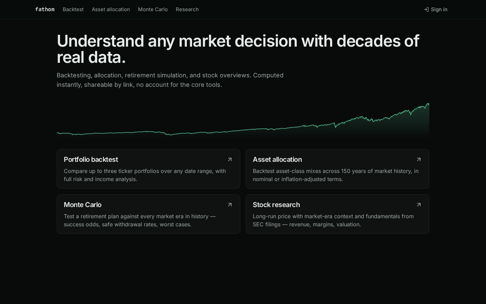

# Fathom

**Live: [ethan-488900.web.app](https://ethan-488900.web.app)**

A market-analysis suite: portfolio backtesting, asset allocation over 155 years of
history, Monte Carlo retirement simulation, SEC-filing stock research, and a
portfolio X-ray that reconstructs your real performance from broker CSV exports.
Free, no account for the core tools, every analysis shareable by link.



## Tools

| Tool | What it does |
|---|---|
| **Backtest** | Compare up to three ticker portfolios over any window — growth, drawdowns, rolling returns, dividend income, Fama-French factor regression. The entire setup lives in the URL (`?p1=VTI:60,BND:40&...`), so any backtest is a shareable, reproducible link. |
| **Asset allocation** | Asset-class mixes backtested 1871 → present (Shiller/FRED data), nominal or inflation-adjusted. |
| **Monte Carlo** | Retirement plans tested against every historical era (rolling-start) or block-bootstrap resampling, in a Web Worker. Fixed-real, fixed-percent, VPW, and Guyton-Klinger guardrails withdrawal strategies; accumulation phase; income-distribution fan charts; max-safe-rate solver. Validated against the Trinity study (96% for 4% / 50-50 / 30y). |
| **Research** | Long-run split-adjusted prices with market-era context, plus fundamentals straight from SEC EDGAR: revenue, margins, quarterly views, balance sheet, and valuation-over-time (P/E, P/S, P/FCF, P/OCF, P/B). |
| **Projections** | Bear/base/bull scenario modeling per stock, prefilled from actual filings, saved per-user (Firebase). |
| **X-ray** | Drop in broker CSV exports (positions + activity history) and get your real time-weighted return, IRR, per-ticker P&L attribution, a same-flows S&P 500 benchmark, dividend income, deposit/growth split, and what the shares you sold would be worth today. Everything is parsed and analyzed in the browser — nothing is uploaded. Exports a versioned `fathom.portfolio` JSON master file. |

## Architecture

```
app/          Vite + React 19 + TypeScript + Tailwind — the whole product
  src/engine/       pure-TS backtest engine (zero deps, fully unit-tested)
  src/montecarlo/   simulation engine + Web Worker
  src/xray/         broker-CSV parsing, TWR/IRR reconstruction, insights
  src/fundamentals/ EDGAR data loaders + share-basis normalization
server/       Cloud Run API — ticker search/admission, nightly refresh
scripts/      data pipeline — Tiingo prices, EDGAR fundamentals,
              Ken French factors, Shiller + FRED asset-class splice
data/         long-horizon asset-class series (1871+), committed
```

- **Data**: daily prices from Tiingo (75 tickers, full history, gzip-at-rest in
  GCS), fundamentals from SEC EDGAR companyfacts, 1871+ asset-class series
  spliced from Shiller and FRED, Fama-French factors from Ken French's library.
  A Cloud Scheduler job refetches nightly — always full-history, never append,
  because adjusted closes rebase on every dividend.
- **Serving**: static app on Firebase Hosting; public data from a GCS bucket;
  a small Cloud Run service admits unknown tickers on demand (Tiingo → bucket →
  catalog, with generation-precondition retries against concurrent writes).
- **Auth**: Google sign-in via Firebase, only for user-owned data. The SDK is
  lazily imported — signed-out visitors never download it.

## Engineering notes

- **The engine is treated as sacred.** Every metric is computed from a
  time-weighted return index (Portfolio Visualizer conventions), never from raw
  values when cash flows exist. Changes require hand-computed fixtures plus
  golden regressions on real data: SPY 1994–2023 CAGR ≈ 10%, GFC drawdown
  troughing March 2009, US stocks 1871–2023 real CAGR ≈ 6.9%.
- **SEC data lies about share counts.** EDGAR companyfacts mixes as-reported and
  split-restated figures (Amazon's FY2021 shares arrive 20:1-adjusted from later
  filings while its year-end price is pre-split — a naive market cap is 20×
  off). Valuation charts resolve each year's share basis by log-proximity
  chaining across every later split basis, repair magnitude errors via
  net-income/EPS, and synthesize missing counts.
- **Broker CSVs are hostile input.** The X-ray parser handles Fidelity's
  formats end-to-end: preamble/disclaimer rows, `MM-DD-YYYY` dates, money-market
  sweep noise, negative-quantity sells, dividends and EFTs as first-class data.
  Merging a positions snapshot with an activity log infers opening holdings
  (current − net trades, split-aware) so the reconstruction covers the whole
  portfolio, then reconciles against the broker's own share counts.
- **History extension is provenance-checked.** The 1871+ series ends where
  Yale's data died (2023-06); a splice script extends it from SPY total returns
  and FRED (GS10, NSA CPI) with byte-identity assertions on the frozen history,
  boundary-continuity checks, and a CAGR invariant band.

## Running locally

```bash
cd app
npm install
# point dev at the public data bucket (or run the pipeline below instead):
echo VITE_DATA_BASE_URL=https://storage.googleapis.com/ethan-488900-fathom-data/ > .env.local
npm run dev
npx vitest run     # engine fixtures, parsers, sims, real-data regressions
npx tsc -b         # strict typecheck
```

Market data (ticker prices, fundamentals) lives in Cloud Storage, not git —
the long-horizon asset-class series and everything the test suite needs are
committed.

## Data pipeline

```bash
node scripts/fetch-tiingo.mjs SPY QQQ ...    # daily prices (needs TIINGO key in .env)
node scripts/build-catalog.mjs               # ticker catalog
node scripts/build-fundamentals.mjs          # SEC EDGAR fundamentals
node scripts/extend-asset-classes.mjs        # Shiller/FRED splice to present
node scripts/build-ff-factors.mjs            # Fama-French 3-factor data
```

## License

[AGPL-3.0](LICENSE) — read it, learn from it, build on it, but derivatives
(including hosted services) must stay open source under the same terms.
