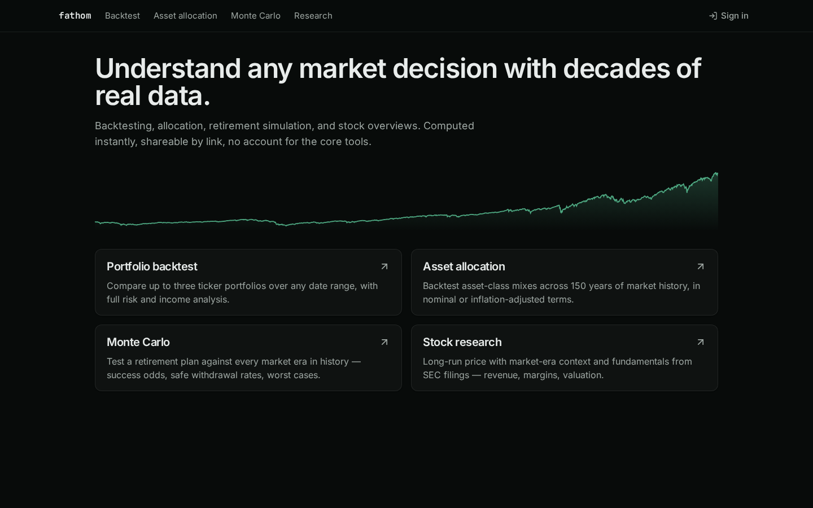

# Fathom

**Live: [ethan-488900.web.app](https://ethan-488900.web.app)**

Most portfolio questions are answerable from public data, but the answers are spread
across a dozen paywalled tools that each own one slice. Fathom puts the slices in one
place: backtest a portfolio, test a retirement plan against every historical era, read a
company's actual SEC filings, and reconstruct what your own brokerage account really did.
The core tools need no account, and every analysis is a shareable link.



## Tools

| Tool | What it does |
|---|---|
| **Backtest** | Compare up to three ticker portfolios over any window: growth, drawdowns, rolling returns, dividend income, Fama-French factor regression. The entire setup lives in the URL (`?p1=VTI:60,BND:40&...`), so any backtest is a shareable, reproducible link. |
| **Asset allocation** | Asset-class mixes backtested 1871 to present (Shiller/FRED data), nominal or inflation-adjusted. |
| **Monte Carlo** | Retirement plans tested against every historical era (rolling-start) or block-bootstrap resampling, in a Web Worker. Fixed-real, fixed-percent, VPW, and Guyton-Klinger guardrails withdrawal strategies; accumulation phase; income-distribution fan charts; max-safe-rate solver. Validated against the Trinity study (96% for 4% / 50-50 / 30y). |
| **Research** | Long-run split-adjusted prices with market-era context, plus fundamentals straight from SEC EDGAR: revenue, margins, quarterly views, balance sheet, and valuation-over-time (P/E, P/S, P/FCF, P/OCF, P/B). |
| **Projections** | Bear/base/bull scenario modeling per stock, prefilled from actual filings, saved per-user (Firebase). |
| **X-ray** | Drop in broker CSV exports (positions plus activity history) and get your real time-weighted return, IRR, per-ticker P&L attribution, a same-flows S&P 500 benchmark, dividend income, deposit/growth split, and what the shares you sold would be worth today. Everything is parsed and analyzed in the browser, so nothing is uploaded. Exports a versioned `fathom.portfolio` JSON master file. |

## Architecture

```
app/          Vite + React 19 + TypeScript + Tailwind, the whole product
  src/engine/       seam over the published backtest engine
  src/montecarlo/   simulation engine + Web Worker
  src/xray/         broker-CSV parsing, TWR/IRR reconstruction, insights
  src/fundamentals/ EDGAR data loaders + share-basis normalization
server/       Cloud Run API for ticker search/admission and nightly refresh
scripts/      data pipeline: Tiingo prices, EDGAR fundamentals,
              Ken French factors, Shiller + FRED asset-class splice
data/         long-horizon asset-class series (1871+), committed
```

The portfolio math lives in one place and only one place. It was extracted verbatim out of
`app/src/engine/` into the npm package
[`@calculator53295/backtest-engine`](https://www.npmjs.com/package/@calculator53295/backtest-engine),
which the app and the Monte Carlo simulator both consume; `app/src/engine/index.ts` is now
a re-export seam so every app import still goes through `@/engine`.

Daily prices come from Tiingo (75 tickers, full history, gzip-at-rest in GCS), fundamentals
from SEC EDGAR companyfacts, the 1871+ asset-class series from a Shiller and FRED splice,
and factor data from Ken French's library. A Cloud Scheduler job refetches nightly, always
full history and never append, because adjusted closes rebase on every dividend.

Serving is a static app on Firebase Hosting reading public data out of a GCS bucket, plus a
small Cloud Run service that admits unknown tickers on demand (Tiingo, then bucket, then
catalog, with generation-precondition retries against concurrent writes). Google sign-in
via Firebase exists only for user-owned data, and the SDK is lazily imported so signed-out
visitors never download it.

## Engineering notes

**The engine is treated as sacred.** Every metric is computed from a time-weighted return
index (Portfolio Visualizer conventions), never from raw values when cash flows exist.
Changes require hand-computed fixtures plus golden regressions on real data: SPY 1994-2023
CAGR of about 10%, a GFC drawdown troughing in March 2009, US stocks 1871-2023 real CAGR of
about 6.9%.

**SEC data lies about share counts.** EDGAR companyfacts mixes as-reported and
split-restated figures. Amazon's FY2021 share count arrives 20:1-adjusted from later
filings while its year-end price is pre-split, so a naive market cap is 20x off. Valuation
charts resolve each year's share basis by log-proximity chaining across every later split
basis, repair magnitude errors via net-income/EPS, and synthesize missing counts. Full
write-up: [docs/notes/edgar-share-basis.md](docs/notes/edgar-share-basis.md).

**Broker CSVs are hostile input.** The X-ray parser handles Fidelity's formats end to end:
preamble and disclaimer rows, `MM-DD-YYYY` dates, money-market sweep noise, negative-quantity
sells, dividends and EFTs as first-class data. Merging a positions snapshot with an activity
log infers opening holdings (current minus net trades, split-aware) so the reconstruction
covers the whole portfolio, then reconciles against the broker's own share counts.

**History extension is provenance-checked.** The 1871+ series ends where Yale's data died
(2023-06). A splice script extends it from SPY total returns and FRED (GS10, NSA CPI) with
byte-identity assertions on the frozen history, boundary-continuity checks, and a CAGR
invariant band.

## Running locally

```bash
cd app
npm install
# point dev at the public data bucket (or run the pipeline below instead):
echo VITE_DATA_BASE_URL=https://storage.googleapis.com/ethan-488900-fathom-data/ > .env.local
npm run dev
npx vitest run     # engine fixtures, parsers, sims, real-data regressions
npx tsc -b         # strict typecheck
```

Market data (ticker prices, fundamentals) lives in Cloud Storage rather than git. The
long-horizon asset-class series and everything the test suite needs are committed.

## Data pipeline

```bash
node scripts/fetch-tiingo.mjs SPY QQQ ...    # daily prices (needs TIINGO key in .env)
node scripts/build-catalog.mjs               # ticker catalog
node scripts/build-fundamentals.mjs          # SEC EDGAR fundamentals
node scripts/extend-asset-classes.mjs        # Shiller/FRED splice to present
node scripts/build-ff-factors.mjs            # Fama-French 3-factor data
```

More detail: [docs/ARCHITECTURE.md](docs/ARCHITECTURE.md) for the system tour,
[docs/data-notes.md](docs/data-notes.md) for data provenance.

## License

[AGPL-3.0](LICENSE). Read it, learn from it, build on it, but derivatives (including hosted
services) must stay open source under the same terms.
