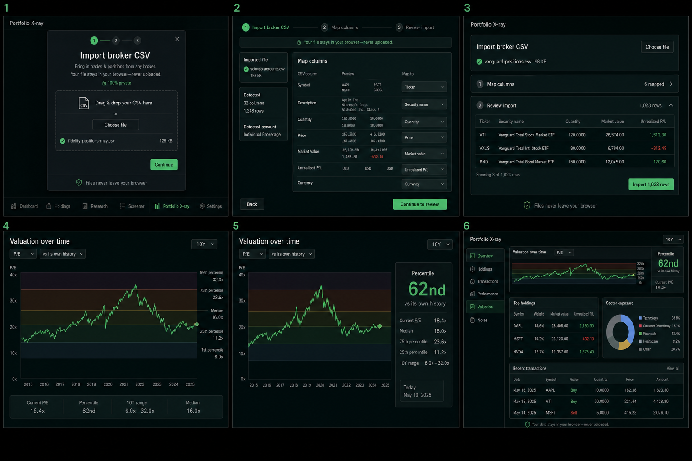

# D6 design: all-broker CSV import and valuation bands

**Date:** 2026-07-16  
**Status:** Proposed design; no implementation or acceptance is implied  
**Scope:** Portfolio X-ray broker import and Stock Research valuation bands  
**Product boundary:** Fathom analyzes markets and securities. It may use a
user-supplied portfolio transiently to perform market analysis, but it does not
become the system of record for accounts, balances, budgets, or net worth.

## Decision summary

1. “All brokers” should mean **any conventional US broker CSV can be imported
   through a generic column/action mapper**, not that Fathom ships and forever
   maintains a bespoke parser for every broker. V1 should add declarative
   presets for Fidelity, Schwab, and Vanguard on top of that generic path.
2. Broker files stay in the browser. Raw file bytes and raw rows live only in
   memory during import and are discarded after normalization. V1 does not
   upload broker data or write it to Firestore. Remembering a portfolio is an
   explicit opt-in that stores only the normalized analysis inputs in IndexedDB.
3. The existing reconstruction and insight engines remain broker-agnostic.
   Import work ends at their existing canonical inputs; it must not fork return
   math by broker.
4. Valuation bands are a derived presentation over the existing annual
   valuation series. The selected metric and visible range define the sample;
   the chart shows 10th/25th/50th/75th/90th percentile context and a compact
   latest-fiscal-year readout. No new market-data pipeline is needed.
5. Do not extract a reusable UI package during these features. First make the
   repeated finance primitives explicit inside Fathom; extract a separately
   versioned Ledger UI kit after a second consumer proves the boundary.

## Existing seams this design reuses

| Existing surface | Relevant behavior | Design consequence |
|---|---|---|
| `app/src/pages/Xray.tsx` | One-shot multi-file import, positions/activity tabs, collapsed input summary, dense result cards and tables | Keep `/xray` and its result hierarchy; replace the Fidelity-shaped import path rather than adding a route |
| `app/src/xray/parse.ts` | Produces `PositionInput`, `TradeInput`, `DividendInput`, and `CashFlowInput` from aliased headers | Preserve these canonical engine-facing types; put file decoding, detection, mapping, and presets in front of them |
| `app/src/xray/analyze.ts` | Broker-independent position analysis, opening-position inference, split-aware reconstruction, TWR/IRR | No broker branches belong here; changes require a separate math justification |
| `app/src/xray/masterfile.ts` | Exports versioned `fathom.portfolio` JSON | Continue explicit user-controlled export; add provenance only if it contains no account/file identifiers |
| `app/src/pages/Stock.tsx` | Existing “Valuation over time” card with metric and All/10Y/5Y segmented controls | Bands belong in this card; no new route, tab, or login |
| `app/src/fundamentals/charts.ts` | Split-basis-resolved annual ratios and an average reference line | Derive percentile context from `valuationSeries`; replace the average-only cue without changing the underlying share-basis repair |
| `app/src/fundamentals/__tests__/valuation.test.ts` | Hand-shaped split/restatement fixtures and AMZN real-data regression | Extend this test style with hand-computed quantile fixtures and preserve all existing regressions |
| `app/src/components/ui/*`, `app/src/components/charts/EChart.tsx` | Ledger Dark primitives, token-resolved charts, disabled destructive hover emphasis | Reuse `Card`, `Dialog`, `Segmented`, `Table`, `Badge`, `Button`, and `EChart`; no raw colors or one-off control language |

The current X-ray page automatically stores raw pasted CSV text in
`localStorage` under `fathom.xray.positions.v1` and
`fathom.xray.trades.v1`. That is inconsistent with the stronger privacy
boundary in this design and should be migrated as part of implementation.

## Shared privacy and finance-master boundary

Fathom may ingest the minimum facts required to answer market-analysis
questions:

- a positions snapshot: ticker and share quantity, plus an optional snapshot
  date;
- executions: trade date, ticker, buy/sell, share quantity, and optional
  execution price;
- cash income: date, ticker, and dividend or foreign-tax amount;
- external flows needed for honest TWR/IRR: date and signed deposit/withdrawal
  amount; and
- non-personal import provenance: normalized broker preset id, file kind,
  schema version, counts, and warnings.

Fathom must not import or retain account number, account name, owner name,
address, tax id, order/confirmation id, broker cash balance, broker-reported
market value, cost basis, tax lots, or freeform descriptions after the row has
been classified. Current position value may be **derived transiently** from
shares and public market prices for X-ray analysis; it is not an authoritative
account balance and is not synced to a Fathom backend.

| Data | Runtime | Local persistence | Firestore/server | Repository |
|---|---|---|---|---|
| Raw CSV bytes, raw rows, filename | Memory only until import completes or is cancelled | Never | Never | Never |
| Header signature and user mapping | Memory; may be reused | IndexedDB/local settings, because it contains column names but no row values | Never in v1 | Generic preset code only |
| Normalized positions/activity | Analysis state | IndexedDB only after explicit “Remember on this device” consent | Never in v1 | Never |
| Derived results | Analysis state | Recomputed from normalized local inputs | Never in v1 | Never |
| `fathom.portfolio` export | Built on demand | User chooses where the browser saves it | Never | Never |
| Test fixtures | Test process | N/A | Never | Synthetic values only |

Real broker samples used during development must remain outside the repo or use
an already ignored `*.local` filename. A sanitizer is not sufficient evidence
that a personal export is safe to commit; committed fixtures must be constructed
synthetically from a documented shape.

The existing raw-CSV `localStorage` keys should be cleared by a one-time client
migration. Do not copy their values into IndexedDB automatically. The user can
re-import and explicitly choose whether normalized inputs are remembered.

---

## Feature A — all-broker CSV import

### User story

> As an investor with exports from any mainstream broker, I can drop my
> positions and activity CSVs into Portfolio X-ray, confirm what Fathom
> recognized, resolve unfamiliar columns or action labels once, and get the
> same trustworthy portfolio analysis without sending the files anywhere.

The tired-at-11pm version is: drop files, see “Fidelity positions + activity
recognized,” scan three counts, press one clear **Analyze portfolio** button.
Broker selection and column mapping appear only when confidence is insufficient.

### Exact UI surfaces

#### 1. `/xray` input area

Keep the page title, explanatory copy, collapsed-input pattern, and all existing
results. At the top of the open input area, add one dense import card before the
manual tabs:

- Title: **Import broker CSV**
- Helper: “Positions, activity, or both. Files stay in this browser.”
- One bordered drop target and primary **Choose CSVs** action; native file input
  accepts multiple `.csv` files.
- A lock/shield line: “Nothing is uploaded. Account identifiers are discarded.”
- A secondary **Enter manually** disclosure reveals the existing Positions and
  Activity history textareas. Manual entry remains a first-class fallback, not
  a second import system.

Do not ask “Which broker?” before reading the file. Detection is automatic, and
the broker selector exists only inside the resolver when needed.

#### 2. Import workspace (conditional dialog)

Use a wide `Dialog` over the X-ray page, with a three-step rail:

1. **Files** — each file row shows a safe browser-only label (`File 1`, not the
   persisted filename), detected broker, detected kind, row count, and status.
   Duplicate file fingerprints are blocked. Overlapping activity date ranges
   warn but are not silently deduplicated.
2. **Map** — skipped entirely when a preset produces a high-confidence valid
   mapping. For unknown files, show a dense table with source header, three
   sample values, and destination field selector. Required fields are marked.
   Activity imports then show a second compact action-value mapper: each unique
   source action maps to Buy, Sell, Dividend, Foreign tax, Deposit, Withdrawal,
   or Ignore. The mapper must never display unrelated sensitive columns.
3. **Review** — show normalized counts (holdings, buys, sells, dividends, flows,
   ignored rows), date range, tickers, and blocking errors/warnings. Preview at
   most five normalized rows with original row numbers. A positions-versus-
   reconstructed-shares reconciliation appears when both file kinds exist.

Primary action: **Analyze portfolio**. Secondary actions: Back and Cancel.
Include an unchecked **Remember normalized data on this device** option with a
short explanation. “Save to account” does not appear in v1.

Known files should normally land directly on Review, with Map reachable through
an **Edit mapping** link. Unknown files land on Map. Zero recognized analysis
rows, missing required semantic fields, invalid dates on every row, or an
unsupported delimiter/encoding are blocking. Partial row failures are warnings
with counts and row numbers, never a silent success.

#### 3. Collapsed inputs after analysis

Extend the existing collapsed Inputs button to read, for example:

`Inputs · Schwab activity + Vanguard positions · 1,204 events`

Opening it returns to the import card and shows:

- a compact import summary without filenames or account identifiers;
- **Replace import**, **Export master file**, and **Forget imported data**;
- the local-persistence state (“Session only” or “Remembered on this device”);
  and
- reconciliation warnings that remain visible until resolved.

Results themselves retain the current ordering: performance metrics, value and
same-flows benchmark, attribution/income/behavior, then the blended holdings
snapshot and Backtest handoff.

#### 4. Responsive and accessibility behavior

- The file target is a real labeled input and works by click, keyboard, or drop.
- Import progress and parse completion use an `aria-live="polite"` region.
- Dialog focus is trapped; Escape cancels without changing the last good
  analysis. Closing a mapper never auto-imports.
- Mapping errors use icons and text, not color alone. Every numerical preview
  cell uses mono + `tnum`.
- On narrow screens the mapping table becomes stacked source-field cards; the
  review counts use a two-column grid and row previews scroll horizontally.
- Parsing must not blank an existing result. Keep the last good analysis dimmed
  behind the workspace, matching Fathom’s stale-while-revalidate convention.

### V1 scope and approach

#### Recommendation: mapping-first core with declarative presets

A parser per broker appears quick for broker two, but it repeats CSV decoding,
preamble detection, date/money parsing, row validation, action classification,
warning semantics, and privacy filtering. It also makes “all brokers” an
unbounded maintenance promise. A generic mapper alone technically handles
everything but makes common imports feel bureaucratic.

Use one pipeline instead:

1. standards-compliant CSV decode (BOM, CRLF, quoted commas/newlines, escaped
   quotes, delimiter sniffing, blank/preamble/footer rows);
2. file-kind and broker-preset confidence scoring;
3. preset or user-approved semantic column mapping;
4. action-value classification;
5. canonical normalization and privacy filtering;
6. validation/reconciliation report; and
7. the existing X-ray analysis functions.

Use a mature streaming CSV decoder such as Papa Parse inside the lazy-loaded
X-ray chunk rather than extending the current one-line splitter into a partial
CSV standard. Keep all semantic normalization in Fathom-owned pure TypeScript so
the dependency cannot decide financial meaning. Parse in a Web Worker for large
files; cap v1 at 10 files, 25 MB per file, and 100,000 rows total with a clear
limit error rather than freezing the page.

Ship these presets in v1:

- **Fidelity positions + activity:** preserves all current recognized behavior
  byte-for-byte, including preamble/disclaimer handling, negative sell
  quantities, dividends, foreign tax, EFT/direct-deposit flows, and money-market
  sweep exclusion.
- **Schwab positions + transactions:** declarative header/action aliases backed
  by synthetic and independently sanitized real-shape verification.
- **Vanguard holdings + transaction history:** same contract and evidence bar.
- **Generic:** any file with enough mapped semantic fields. This is what makes
  the product honestly “all-broker” even when no named preset exists.

Robinhood, E*TRADE, Interactive Brokers, Merrill, and others become additional
preset packs, not new parser architectures. A preset must not be advertised as
supported until a real export shape has been verified without committing the
export.

V1 supports common US-listed stocks, ETFs, and mutual funds represented by a
Fathom ticker. Options, bonds identified only by CUSIP, crypto, mergers,
spin-offs, journals between accounts, tax-lot accounting, fees/commissions as a
separate performance model, OFX/QFX, PDFs, and direct broker connections are out
of scope. Unsupported rows must be counted and named by category.

### Data model and location

The import layer should live under `app/src/xray/import/`; existing analysis
types remain the engine-facing contract.

```ts
type BrokerId = 'fidelity' | 'schwab' | 'vanguard' | 'generic'
type ImportFileKind = 'positions' | 'activity' | 'unknown'

interface ColumnMapping {
  kind: 'positions' | 'activity'
  columns: Partial<Record<
    | 'date' | 'ticker' | 'action' | 'shares' | 'price' | 'amount'
    | 'positionAsOf',
    string
  >>
  actionValues: Record<string,
    'buy' | 'sell' | 'dividend' | 'foreignTax' |
    'deposit' | 'withdrawal' | 'ignore'>
  decimalConvention: 'us'
}

interface NormalizedBrokerImport {
  schemaVersion: 1
  positions: PositionInput[]
  trades: TradeInput[]
  dividends: DividendInput[]
  cashFlows: CashFlowInput[]
  provenance: {
    brokers: BrokerId[]
    fileKinds: Array<'positions' | 'activity'>
    importedAt: string
    dateRange: { start: string; end: string } | null
    counts: ImportCounts
  }
  report: ImportReport
}
```

`NormalizedBrokerImport` must not contain a filename, account identifier,
unmapped cell, raw description, broker balance, or raw row. The persistence
wrapper stores this object in IndexedDB only after consent, keyed by a random
local portfolio id. Mapping preferences are keyed by a hash of normalized
headers + detected kind, never by account or filename.

Preset modules are data plus small normalizers, not subclasses:

```ts
interface BrokerPreset {
  id: Exclude<BrokerId, 'generic'>
  score(headers: string[], sampleRows: string[][]): number
  suggest(kind: ImportFileKind, headers: string[]): ColumnMapping | null
  classifyAction(raw: MappedRow): ActionClassification
  ignoreRow(raw: MappedRow): string | null
}
```

### Engine and test strategy

No change is planned in `app/src/engine/` or the shared
`@calculator53295/backtest-engine` package. `inferOpeningPositions`,
`reconstructHistory`, and `computeInsights` receive the same canonical values
they receive today. If a broker format exposes a corporate action the canonical
model cannot represent, stop and report it; do not encode it as a fake buy,
sell, dividend, or flow.

Required tests:

- CSV decoding fixtures: BOM, CRLF, quoted comma, escaped quote, embedded
  newline, tab/semicolon delimiter, preamble, disclaimer footer, empty cells,
  parentheses negatives, currency symbols, Unicode minus, and the size/row
  limits.
- Detection fixtures: positions vs activity, preset confidence ties, unknown
  broker, duplicate file fingerprint, and overlapping date-range warning.
- Mapping fixtures: required-field validation, ambiguous aliases, negative sells,
  action-value mapping, ignored sensitive columns, and saved mapping round-trip.
- One synthetic positions and one synthetic activity fixture for each named
  preset. Existing Fidelity expectations remain unchanged.
- Hand-computed normalization-to-analysis fixtures: a flat-price buy/sell file
  has zero TWR; a known cash flow does not distort TWR; a split keeps value
  continuous; positions + activity reconcile to exact ending shares.
- Privacy tests assert serialized normalized/import-report objects contain none
  of the synthetic account number/name, raw description, cash-balance, or
  filename sentinels.
- Storage tests assert raw CSV is never written, consent-off survives only in
  memory, consent-on round-trips normalized data, and Forget removes only the
  selected local portfolio.
- DOM acceptance in a running preview: known-preset happy path, unknown mapping
  path, partial-warning path, keyboard-only flow, mobile mapping layout, and
  last-good-results retention. Because the sandbox cannot bind a preview port,
  this gate must run in the normal outside-sandbox preview environment.

Every implementation lane runs from `app/`:

```bash
npx vitest run
npx tsc -b
```

---

## Feature B — valuation percentile bands

### User story

> As an investor researching a stock, I can tell whether its latest comparable
> fiscal-year valuation sits low, typical, or high relative to its own selected
> history, without mistaking that context for a forecast or a buy/sell signal.

At 11pm, the answer should be visible in one glance: “latest FY P/E 18.4×,
62nd percentile; central 50% was 11.2–23.6×.” The chart remains legible without
reading every boundary label.

### Exact UI surface

Only the existing **Valuation over time** card on `/stock/:symbol` changes.
Keep its metric selector (`P/E`, `P/S`, `P/FCF`, `P/OCF`, `P/B`) and range
selector (`All`, `10Y`, `5Y`).

Inside the card:

1. Retain the annual ratio line and tooltip.
2. Replace the single average line with five quiet horizontal regions bounded
   by the 10th, 25th, 50th, 75th, and 90th percentiles. Use Ledger chart tokens
   at low opacity; high valuation is not red and low valuation is not a green
   recommendation. Labels are neutral: **lower tail**, **lower quartile**,
   **central 50%**, **upper quartile**, **upper tail**.
3. Draw the median as the only always-labeled dashed boundary. Other boundary
   values appear in the tooltip and summary, preventing chart-label clutter.
4. Add a dense summary strip below the chart:
   - `Latest FY 18.4×`
   - `Percentile 62nd`
   - `10–90% 6.0–32.0×`
   - `Median 16.0×`
5. Extend the tooltip with fiscal year, ratio, percentile rank within the
   selected valid sample, and the sample size. Copy says **latest FY**, never
   “today,” because the historical series uses fiscal-year fundamentals and
   year-end price. The separate headline P/E card may remain TTM.
6. Under the summary, show one muted sentence: “Historical position, not a
   fair-value estimate.”

On mobile the summary becomes a two-by-two grid beneath the full-width chart.
Do not add a persistent right rail that shrinks the chart. If fewer than eight
positive comparable observations exist, show the line without bands and say:
“Not enough comparable history for bands (N valid years). Try a longer range.”
The 5Y control remains useful even though it will normally suppress bands.

### Band semantics

The selected metric and selected visible range define one sample. This keeps
the chart, labels, and percentile claim aligned. Values are computed from the
existing full-precision annual ratio result, then rounded only for display.

- Eligible observations are finite and strictly greater than zero. Negative or
  zero P/E years remain part of the underlying history behavior but are not
  comparable valuation multiples and do not enter percentile calculations.
- The five boundaries are P10, P25, P50, P75, and P90 using linear interpolation
  on the sorted sample (Hyndman–Fan type 7): `h = (n - 1) * p`, then interpolate
  between `floor(h)` and `ceil(h)`.
- Latest means the last eligible fiscal-year point in the selected range.
- Its percentile rank uses midrank for ties:
  `100 * (countLess + 0.5 * countEqual) / n`, rounded to the nearest integer for
  display.
- The latest point is included in the sample. This is descriptive historical
  context, not an out-of-sample valuation model.
- A minimum of eight eligible points is required to render bands. Missing
  fundamentals remain gaps; bands never invent or forward-fill a ratio.

### Data model and location

No persisted or server data is added. Public daily prices continue to come from
the ticker series, and public fundamentals continue to come from the existing
GCS-served `Fundamentals` documents. The derived model lives in memory:

```ts
interface ValuationBandSummary {
  metric: ValuationMetric
  sampleCount: number
  latest: { fiscalYear: string; value: number; percentile: number } | null
  boundaries: {
    p10: number
    p25: number
    p50: number
    p75: number
    p90: number
  } | null
}
```

Put pure percentile/filter/rank logic in
`app/src/fundamentals/valuationBands.ts`. Keep ECharts construction in
`app/src/fundamentals/charts.ts` and page state/copy in
`app/src/pages/Stock.tsx`. Do not add Firestore, URL parameters, new GCS files,
or a new route.

### V1 scope

V1 covers the five annual metrics already rendered and the existing All/10Y/5Y
ranges. It does not add daily or quarterly valuation histories, sector/peer
comparisons, a composite valuation score, forecasts, fair-value targets,
alerts, screener filters, ETF valuation bands, or investment-advice language.

The latest-fiscal-year basis is deliberate. A future pass may add a separately
labeled TTM/current point only after all five metrics have consistent trailing
denominators; mixing today’s P/E with fiscal-year P/S/FCF/OCF/B would make the
surface look more precise while reducing comparability.

### Engine and test strategy

This feature does not touch portfolio engine math. It extends pure fundamentals
presentation math and therefore uses the same fixture rigor:

- Hand-computed quantile fixture `[10, 20, 30, 40, 50]` must yield P10 `14`,
  P25 `20`, P50 `30`, P75 `40`, and P90 `46` under type-7 interpolation.
- Fixtures cover unsorted input, duplicate values/midrank, null/NaN/infinity,
  zero and negative exclusion, fewer-than-eight suppression, exactly-eight
  enablement, a missing latest point, and no input mutation.
- A chart-option structural test confirms five ordered regions, one median
  label, token-resolved colors, disabled emphasis, and no average reference.
- Existing AMZN and synthetic split-basis tests remain green; add a real-data
  regression that every emitted boundary is finite, ordered, and inside the
  eligible sample bounds when committed data exists.
- DOM acceptance checks all five metrics, All/10Y/5Y, insufficient-history copy,
  mobile summary wrapping, keyboard control, tooltip sample disclosure, and the
  15px text floor.

---

## UI mockup round



The six generated directions intentionally test different information
architectures rather than color variants:

1. centered guided import dialog;
2. full-width three-step mapping workspace;
3. compact inline progressive-disclosure import and review;
4. valuation chart with labeled horizontal zones and bottom summary;
5. valuation chart with a persistent right-side percentile rail; and
6. a combined portfolio/research dashboard.

**Recommendation:** combine 3’s quiet inline entry with 2’s mapping depth only
when ambiguity exists; combine 4’s full-width chart and bottom summary with 5’s
strong percentile hierarchy, but do not keep the right rail. Reject 1 as too
modal for routine re-import, and reject 6 because it creates a new dashboard
instead of strengthening Fathom’s existing task-focused routes. The mockups are
layout probes, not pixel specifications; implementation must use the actual
Ledger Dark tokens and existing components.

## Reusable Fathom UI kit evaluation

There is a real extractable kit, but the package boundary is not ready today.
Candidate layers are:

- **Ledger tokens:** surface ladder, typography floor, spacing density, radii,
  semantic gain/loss/chart colors, and `tnum`/mono rules from `index.css`;
- **interaction primitives:** Fathom-configured Button, Card, Table, Tabs,
  Segmented, Dialog, Popover, Select, Skeleton, Tooltip, and Toast wrappers;
- **finance display primitives:** a shared `MetricCard`, `NumericCell`,
  `DenseDataTable`, `RangeSegmented`, `ChartFrame`, empty/loading/error states,
  and progressive-disclosure row actions; and
- **chart recipes:** `baseOption`, token resolution, export affordance, range
  controls, tooltip typography, band/mark-line helpers, and the “no destructive
  hover emphasis” rule.

Do not extract ticker/data loaders, X-ray import UI, projection controls, or
stock-specific charts. They are product components, not primitives.

Today these pieces depend on Fathom’s Tailwind build, `@/` aliases, ECharts
registration, and page-local assumptions; `Stat` is still duplicated across
pages. Packaging now would add versioning, CSS-consumer setup, peer-dependency,
Storybook/demo, accessibility, visual-regression, and migration work while both
features are still revealing the right APIs. Estimate four to seven focused
sessions for a credible package plus first-consumer migration, versus one or two
sessions to factor the obvious primitives locally.

**Recommendation:** later. During these features, create/reuse local primitives
under `app/src/components/` when a pattern has at least two live call sites.
Re-evaluate a separate `@calculator53295/ledger-ui` package after finance-master
or another product is ready to consume the same `MetricCard`, `ChartFrame`, and
tokens. Keep it separate from the backtest-engine package so UI release cadence
cannot destabilize sacred math.

## Phased implementation lanes

Each lane is sized for one Codex session. Leases list literal repo-relative
ownership; lanes with dependencies run sequentially even when paths are
disjoint. Every code lane ends with `npx vitest run` and `npx tsc -b` from
`app/`; UI lanes also need outside-sandbox preview DOM verification.

| Phase / lane | Depends on | Owns paths | Deliverable and acceptance |
|---|---|---|---|
| **A1 — import contracts + CSV decoder** | — | `app/src/xray/import/types.ts`, `app/src/xray/import/csv.ts`, `app/src/xray/__tests__/import-csv.test.ts`, `app/package.json`, `app/package-lock.json` | Lazy/worker-safe standards-compliant decoder, limits, canonical import/report contracts, hostile-CSV fixtures; no analysis behavior change |
| **A2 — detection + generic mapper** | A1 | `app/src/xray/import/detect.ts`, `app/src/xray/import/mapping.ts`, `app/src/xray/import/normalize.ts`, `app/src/xray/__tests__/import-generic.test.ts` | File-kind scoring, semantic mappings, action classifier, privacy filtering, deterministic reports; generic unknown CSV reaches canonical inputs |
| **A3 — Fidelity preset regression** | A2 | `app/src/xray/import/presets/fidelity.ts`, `app/src/xray/__tests__/import-fidelity.test.ts`, `app/src/xray/__fixtures__/fidelity-*` | Existing Fidelity positions/activity outcomes preserved, including flows and sweep noise; all fixtures synthetic |
| **A4 — Schwab preset** | A2 | `app/src/xray/import/presets/schwab.ts`, `app/src/xray/__tests__/import-schwab.test.ts`, `app/src/xray/__fixtures__/schwab-*` | Positions and transactions normalize through shared contracts; verified real shape recorded without committing personal data |
| **A5 — Vanguard preset** | A2 | `app/src/xray/import/presets/vanguard.ts`, `app/src/xray/__tests__/import-vanguard.test.ts`, `app/src/xray/__fixtures__/vanguard-*` | Holdings and activity normalize through shared contracts; verified real shape recorded without committing personal data |
| **A6 — import workspace UI** | A2–A5 | `app/src/components/xray/BrokerImportWorkspace.tsx`, `app/src/components/xray/ColumnMapper.tsx`, `app/src/components/xray/ImportReview.tsx`, `app/src/xray/import/import.worker.ts` | Known files skip to Review, unknown files map accessibly, progress stays responsive, no sensitive columns rendered |
| **A7 — X-ray integration + local privacy migration** | A6 | `app/src/pages/Xray.tsx`, `app/src/xray/storage.ts`, `app/src/xray/masterfile.ts`, `app/src/xray/__tests__/storage.test.ts` | Unified import drives existing results; raw localStorage persistence removed; consented normalized IndexedDB persistence, Forget, safe export, last-good-results behavior |
| **B1 — valuation band math** | — | `app/src/fundamentals/valuationBands.ts`, `app/src/fundamentals/__tests__/valuationBands.test.ts` | Type-7 percentiles, midrank, eligibility/minimum rules, hand-computed fixtures; no chart/page changes |
| **B2 — valuation chart + Research UI** | B1 | `app/src/fundamentals/charts.ts`, `app/src/pages/Stock.tsx`, `app/src/fundamentals/__tests__/valuation-bands-chart.test.ts` | Tokenized 10/25/50/75/90 regions, latest-FY summary, insufficient-history state, all existing valuation regressions green |
| **Q1 — integrated QA and durable docs** | A7, B2 | `README.md`, `docs/ARCHITECTURE.md`, `docs/VISION.md`, `docs/HANDOFF_ROADMAP.md` | Full test/typecheck/build, preview DOM matrix, privacy wording and supported-format claims match reality, completed roadmap items dated without inferring acceptance |

A1/A2 precede preset work. A3, A4, and A5 can run in parallel because they own
disjoint preset/test/fixture files. B1 can run in parallel with all importer
work. A7 and B2 are the first lanes that touch existing page/chart hotspots and
should retain exclusive leases for those exact paths.

### Stop conditions for implementation lanes

- A real broker export would need to be committed to make a preset pass.
- A preset requires retaining account identifiers or broker-reported balances.
- An unsupported event would have to be disguised as another financial event.
- Import correctness requires modifying TWR/IRR or shared engine behavior; open
  a separately scoped engine lane with hand-computed and golden fixtures.
- Valuation bands require changing the EDGAR data schema or pipeline; report the
  missing denominator instead of inventing it.
- Any UI lane needs a new raw color, sub-15px text, or more than seven initially
  visible controls to make the design fit.
- Any lane needs cloud mutation or deploy. Prepare evidence and park the owner
  action; do not run it.

## Open questions for Ethan

These are directional choices only Ethan should accept. Workflow state must not
be treated as acceptance.

1. **Named preset launch set.** Is Fidelity + Schwab + Vanguard the right v1
   promise, with every other broker supported through the generic mapper?
   **Recommendation:** yes; add Robinhood only after obtaining a verified export
   shape because its available exports may not provide a positions snapshot.
2. **Local persistence default.** Should normalized broker data be session-only
   unless the user explicitly checks “Remember on this device”?
   **Recommendation:** yes. It is the least surprising treatment for the most
   sensitive input Fathom accepts.
3. **Future account sync.** Does the older Vision idea of opt-in Firestore save
   still stand given the stronger “never personal account balances” boundary?
   **Recommendation:** no Firestore for broker-derived positions/activity. If
   reconsidered later, require an explicit new decision, per-uid rules, field
   allowlisting, consent, deletion UX, and no raw rows or identifiers.
4. **Multiple accounts.** Should multiple selected account exports merge into
   one analysis without account labels in v1?
   **Recommendation:** yes. Per-account grouping turns Fathom toward account
   aggregation and finance-master’s domain.
5. **Asset/event coverage.** Is an explicit stocks/ETFs/mutual-funds scope with
   visible unsupported-row reporting acceptable for “all brokers”?
   **Recommendation:** yes. Options, bonds/CUSIPs, crypto, tax lots, and complex
   corporate actions need separate domain models and should never be guessed.
6. **Valuation reference range.** Should bands recompute from the selected
   All/10Y/5Y window, or always use all available history?
   **Recommendation:** selected range, with an eight-valid-year minimum and clear
   sample size, so the visual claim matches what the user sees.
7. **Valuation endpoint.** Is “latest fiscal year” sufficient for v1, despite
   the headline P/E card already having TTM data?
   **Recommendation:** yes. Add a current/TTM marker only when all five metrics
   can use comparable trailing denominators.
8. **Reusable UI kit timing.** Extract a package now or after these features?
   **Recommendation:** later; factor repeated primitives locally now, then use a
   real second consumer to set the package boundary.

## Definition of done for the combined story

- Any structurally conventional US broker CSV can reach canonical X-ray inputs
  through the generic mapper; Fidelity, Schwab, and Vanguard happy paths require
  no manual mapping for verified shapes.
- No raw broker file, raw row, filename, account identifier, broker balance, or
  cost-basis field is persisted, uploaded, logged, committed, or added to a URL.
- Existing Fidelity normalization and all X-ray TWR/IRR/split fixtures remain
  green; unsupported activity is explicit rather than silently reclassified.
- `/stock/:symbol` renders tokenized P10/P25/P50/P75/P90 context for every
  eligible existing metric, with honest latest-FY and sample-size copy.
- Existing split-basis and AMZN valuation regressions remain green.
- Desktop/mobile/keyboard/partial-failure states pass preview DOM verification;
  busy states keep the last good result visible.
- `npx vitest run`, `npx tsc -b`, and `npm run build` pass from `app/`.
- Public docs describe only formats actually verified; roadmap completion and
  Ethan acceptance are recorded as separate facts.
